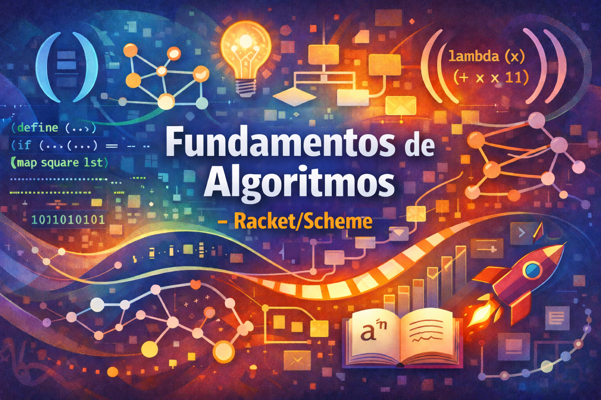

# Fundamentos de Algoritmos - Racket

Este repositório contém códigos, exemplos e exercícios para a disciplina **INF05008 - FUNDAMENTOS DE ALGORITMOS**, ministrada no **Instituto de Informática** da **Universidade Federal do Rio Grande do Sul (UFRGS)**.

O objetivo deste material é servir de apoio ao aprendizado dos conceitos fundamentais de algoritmos, lógica de programação e paradigma funcional, utilizando a linguagem Racket (baseada em Scheme).

Você pode consultar a súmula, objetivos e conteúdo programático completo da disciplina no arquivo [PlanodeEnsino.pdf](./PlanodeEnsino.pdf).

## 📚 Bibliografia e Livro Texto

A disciplina segue a metodologia e conteúdo do livro:

*   **"How to Design Programs"** (HtDP)
    *   Autores: Matthias Felleisen, Robert Bruce Findler, Matthew Flatt, Shriram Krishnamurthi
    *   Disponível online em: [https://htdp.org/](https://htdp.org/)

## 🛠️ Ferramentas e Ambiente

Os códigos deste repositório são escritos em **Racket** (uma variante de Scheme). Para executar e editar os arquivos, recomenda-se o uso das seguintes ferramentas:

*   **[DrRacket](https://racket-lang.org/)**: O ambiente de desenvolvimento (IDE) oficial e recomendado para a disciplina. Permite executar os programas passo-a-passo e visualizar estruturas de dados.
*   **[WeScheme](https://www.wescheme.org/)**: Uma alternativa baseada em navegador para programação em Racket.

---

## 📂 Catálogo de Arquivos

O repositório está organizado em duas seções principais: **Aulas** (exemplos vistos em aula) e **Exercícios** (práticas, laboratórios e provas).

### Relação de Aulas (`/aulas`)

| Arquivo | Descrição |
| :--- | :--- |
| [`aula02.rkt`](./aulas/aula02.rkt) | Introdução a expressões aritméticas básicas, strings e geração simples de imagens. |
| [`aula03.rkt`](./aulas/aula03.rkt) | Projeto de algoritmos. Definição de funções simples, como cálculo de área de círculo e anel. |
| [`aula04.rkt`](./aulas/aula04.rkt) | Tipos de dados básicos (números, strings, imagens, booleanos) e expressões a eles associadas.Estruturas condicionais (`cond`) e predicados de comparação. |
| [`aula05.rkt`](./aulas/aula05.rkt) | Estruturas condicionais (`cond`) e predicados de comparação. |
| [`aula07.rkt`](./aulas/aula07.rkt) | Estruturas de dados. Exemplos de funções matemáticas mais complexas e cálculo de mira/ângulo. |
| [`aula11.rkt`](./aulas/aula11.rkt) | Introdução à estrutura de dados Lista (`cons`, `first`, `rest`). |
| [`aula12.rkt`](./aulas/aula12.rkt) | Definição formal e exemplos de estruturas de dados do tipo ListaDeNumeros. |
| [`aula17.rkt`](./aulas/aula17.rkt) | Estruturas de dados com auto-referência e compostas (structs) como `pessoa` e introdução a Árvores. |
| [`aula22.rkt`](./aulas/aula22.rkt) | Uso de definições locais (`local`) e escopo de variáveis em funções. |
| [`aula23.rkt`](./aulas/aula23.rkt) | Funções de alta-ordem. Definição de estruturas (`define-struct`) aplicada a cartas de baralho. |
| [`aula24.rkt`](./aulas/aula24.rkt) | Funções de alta-ordem. Definição recursiva de listas e manipulação de ListaDeNúmeros. |
| [`aula25.rkt`](./aulas/aula25.rkt) | Introdução à discussão sobre eficiência de algoritmos (tempo e espaço). |
| [`conta_multiplos.rkt`](./aulas/conta_multiplos.rkt) | Função recursiva que conta quantos números em uma lista são múltiplos de 3. |
| [`map_condicional.rkt`](./aulas/map_condicional.rkt) | Implementação de uma função de alta ordem `map` com aplicação condicional. |
| [`quicksort.rkt`](./aulas/quicksort.rkt) | Estrutura para implementação do algoritmo de ordenação Quicksort. |
| [`testa_soma.rkt`](./aulas/testa_soma.rkt) | Função de teste de soma com tratamento de erros retornando símbolos. |

### Relação de Exercícios (`/exercicios`)

| Arquivo | Descrição |
| :--- | :--- |
| [`projeto01_enunciado_pokemon.rkt`](./exercicios/projeto01_enunciado_pokemon.rkt) | Enunciado e template para o Projeto 1 (Tema: Pokemon). |
| [`projeto02_enunciado_pokemon.rkt`](./exercicios/projeto02_enunciado_pokemon.rkt) | Enunciado e instruções para o desenvolvimento do Projeto 2. |
| [`projeto03_enunciado_pokemon.rkt`](./exercicios/projeto03_enunciado_pokemon.rkt) | Enunciado e instruções para o desenvolvimento do Projeto 3. |
| [`projeto_petshop.rkt`](./exercicios/projeto_petshop.rkt) | Exercício prático (Lista 01) envolvendo gerenciamento de um Petshop. |
| [`projeto_supertrunfo.rkt`](./exercicios/projeto_supertrunfo.rkt) | Laboratório 01: desenvolvimento do jogo Super Trunfo. |
| [`prova01_questao_listas.rkt`](./exercicios/prova01_questao_listas.rkt) | Questão de prova abordando manipulação de listas de posições (`Posn`). |
| [`prova01_revisao.rkt`](./exercicios/prova01_revisao.rkt) | Exercícios de revisão preparatórios para a Prova 1 (validação de dados). |
| [`prova02.rkt`](./exercicios/prova02.rkt) | Questão de prova sobre recursão para encontrar o menor elemento de uma lista. |

---

## 📜 Licença

Este material é de uso educacional. Consulte o arquivo [LICENSE](./LICENSE) para mais detalhes sobre os termos de uso.

## 🏛️ Institucional

**Universidade Federal do Rio Grande do Sul (UFRGS)**
*   [Instituto de Informática](https://www.inf.ufrgs.br/)
*   [Página da UFRGS](http://www.ufrgs.br/)

## 👥 Créditos e Contatos

Professores: **Bruno Iochins Grisci**: [brunogrisci.github.io](https://brunogrisci.github.io/)

Material baseado nas aulas da Professora Responsável: **Leila Ribeiro**

## ❗ Veja também

*   [GitHub das disciplinas de Projeto e Análise de Algoritmos I e II](https://github.com/BrunoGrisci/projeto-e-analise-de-algoritmos.git)